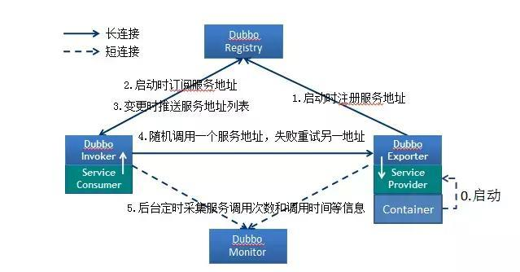
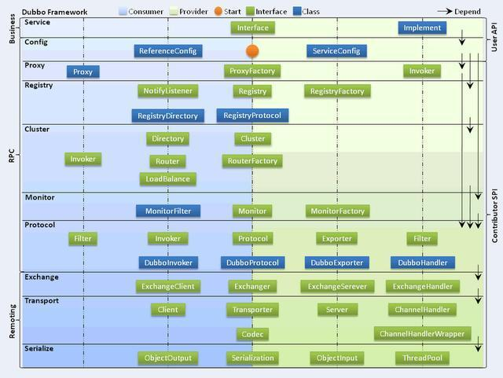

### 1.Dubbo 是什么？

一个分布式、高性能、透明化的 RPC 服务框架，提供服务自动注册、自动发现等高效服务治理方案， 可以和 Spring 框架无缝集成。

### 2.Dubbo 的主要应用场景？

- 透明化的远程方法调用，就像调用本地方法一样调用远程方法，只需简单配置，没有任何 API 侵入。
- 软负载均衡及容错机制，可在内网替代 F5 等硬件负载均衡器，降低成本，减少单点。
- 服务自动注册与发现，不再需要写死服务提供方地址，注册中心基于接口名查询服务提供者的 IP 地址，并且能够平滑添加或删除服务提供者。

### 3.Dubbo 的核心功能？

- Remoting：网络通信框架，提供对多种 NIO 框架抽象封装，包括“同步转异步”和“请求-响应”模式的信息交换方式。
- Cluster：服务框架，提供基于接口方法的透明远程过程调用，包括多协议支持，以及软负载均衡，失败容错，地址路由，动态配置等集群支持。
- Registry：服务注册，基于注册中心目录服务，使服务消费方能动态的查找服务提供方，使地址透明，使服务提供方可以平滑增加或减少机器。

### 4.dubbo 的核心组件

- Provider
- Consumer
- Registery
- Monitor 统计服务的调用次数和调用时间的监控中心。
- Container

流程说明：

- Provider 连接注册中心，并发本机 IP、端口、应用信息和提供服务信息发送至注册中心存储
- Consumer 连接注册中心 ，并发送应用信息、所求服务信息至注册中心
- 注册中心根据消费者所求服务信息匹配对应的提供者列表发送至 Consumer 应用缓存。
- Consumer 在发起远程调用时基于缓存的消费者列表择其一发起调用。
- Provider 状态变更会实时通知注册中心、在由注册中心实时推送至 Consumer

设计的原因：

- Consumer 与 Provider 解偶，双方都可以横向增减节点数。
- 注册中心对本身可做对等集群，可动态增减节点，并且任意一台宕掉后，将自动切换到另一台
- 去中心化，双方不直接依懒注册中心，即使注册中心全部宕机短时间内也不会影响服务的调用
- 服务提供者无状态，任意一台宕掉后，不影响使用

### 5.dubbo 的架构设计

Dubbo 框架设计一共划分了 10 个层：

- 服务接口层（Service）：该层是与实际业务逻辑相关的，根据服务提供方和服务消费方的业务设计对应的接口和实现。
- 配置层（Config）：对外配置接口，以 ServiceConfig 和 ReferenceConfig 为中心。
- 服务代理层（Proxy）：服务接口透明代理，生成服务的客户端 Stub 和服务器端 Skeleton。
- 服务注册层（Registry）：封装服务地址的注册与发现，以服务 URL 为中心。
- 集群层（Cluster）：封装多个提供者的路由及负载均衡，并桥接注册中心，以 Invoker 为中心。
- 监控层（Monitor）：RPC 调用次数和调用时间监控。
- 远程调用层（Protocol）：封将 RPC 调用，以 Invocation 和 Result 为中心，扩展接口为 Protocol、Invoker 和 Exporter。
- 信息交换层（Exchange）：封装请求响应模式，同步转异步，以 Request 和 Response 为中心。
- 网络传输层（Transport）：抽象 mina 和 netty 为统一接口，以 Message 为中心。

### 6.dubbo 有哪些注册中心

- Multicast 注册中心： Multicast 注册中心不需要任何中心节点，只要广播地址，就能进行服务注册和发现。基于网络中组播传输实现；
- Zookeeper 注册中心： 基于分布式协调系统 Zookeeper 实现，采用 Zookeeper 的 watch 机制实现数据变更；
- redis 注册中心： 基于 redis 实现，采用 key/Map 存储，住 key 存储服务名和类型，Map 中 key 存储服务 URL，value 服务过期时间。基于 redis 的发布/订阅模式通知数据变更；
- Simple 注册中心

### 7.注册中心集群挂掉，发布者和订阅者之间还能通信么？

可以的，启动 dubbo 时，消费者会从 zookeeper 拉取注册的生产者的地址接口等数据，缓存在本地。每次调用时，按照本地存储的地址进行调用。

### 8.Dubbo 使用的是什么通信框架?

默认使用 NIO Netty 框架

### 9.Dubbo 集群提供了哪些负载均衡策略？

- Random LoadBalance: 随机选取提供者策略，有利于动态调整提供者权重。截面碰撞率高，调用次数越多，分布越均匀；
- RoundRobin LoadBalance: 轮循选取提供者策略，平均分布，但是存在请求累积的问题；
- LeastActive LoadBalance: 最少活跃调用策略，解决慢提供者接收更少的请求；
- ConstantHash LoadBalance: 一致性 Hash 策略，使相同参数请求总是发到同一提供者，一台机器宕机，可以基于虚拟节点，分摊至其他提供者，避免引起提供者的剧烈变动；

### 10.Dubbo 的集群容错方案有哪些？

- Failover Cluster (默认方案)
  失败自动切换，当出现失败，重试其它服务器。通常用于读操作，但重试会带来更长延迟。
- Failfast Cluster
  快速失败，只发起一次调用，失败立即报错。通常用于非幂等性的写操作，比如新增记录。
- Failsafe Cluster
  失败安全，出现异常时，直接忽略。通常用于写入审计日志等操作。
- Failback Cluster
  失败自动恢复，后台记录失败请求，定时重发。通常用于消息通知操作。
- Forking Cluster
  并行调用多个服务器，只要一个成功即返回。通常用于实时性要求较高的读操作，但需要浪费更多服务资源。可通过 forks=”2″ 来设置最大并行数。
- Broadcast Cluster
  广播调用所有提供者，逐个调用，任意一台报错则报错 。通常用于通知所有提供者更新缓存或日志等本地资源信息。

### 11.Dubbo 支持哪些序列化方式？

默认使用 Hessian 序列化，还有 Duddo、FastJson、Java 自带序列化。

### 12.Dubbo 超时时间怎样设置？

Dubbo 超时时间设置有两种方式：

- Provider 设置超时时间，在 Dubbo 的用户文档中，推荐如果能在服务端多配置就尽量多配置，因为服务提供者比消费者更清楚自己提供的服务特性。
- Consumer 设置超时时间，如果在消费者端设置了超时时间，以消费者端为主，即优先级更高。因为服务调用方设置超时时间控制性更灵活。如果消费方超时，服务端线程不会定制，会产生警告。

dubbo 在调用服务不成功时，默认是会重试两次的。

### 13.Dubbo 在安全机制方面是如何解决？

Dubbo 通过 Token 令牌防止用户绕过注册中心直连，然后在注册中心上管理授权。Dubbo 还提供服务黑白名单，来控制服务所允许的调用方。

### 14.dubbo 和 dubbox 之间的区别？

dubbox 基于 dubbo 上做了一些扩展，如加了服务可 restful 调用，更新了开源组件等。

### 15.Dubbo 和 Spring Cloud 的关系？

- Dubbo 是 SOA 时代的产物，它的关注点主要在于服务的调用，流量分发、流量监控和熔断。
- 而 Spring Cloud 诞生于微服务架构时代，考虑的是微服务治理的方方面面。
- 两个框架在开始目标就不一致，Dubbo 定位服务治理、Spirng Cloud 是一个生态。
