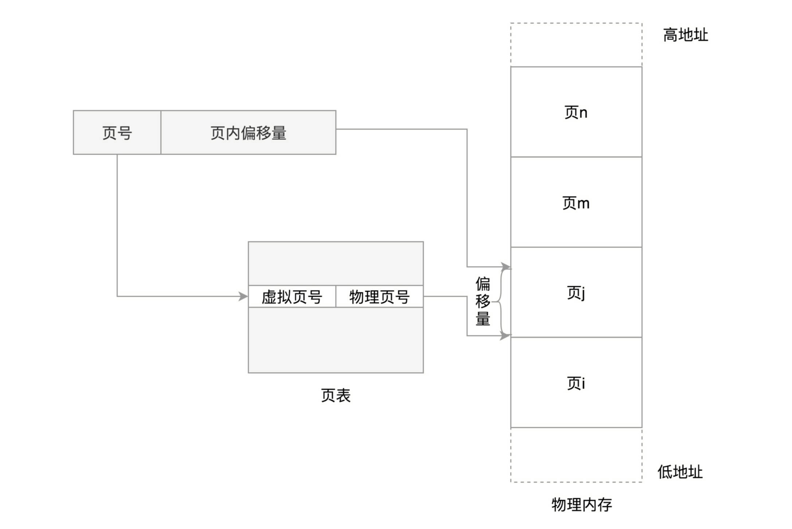
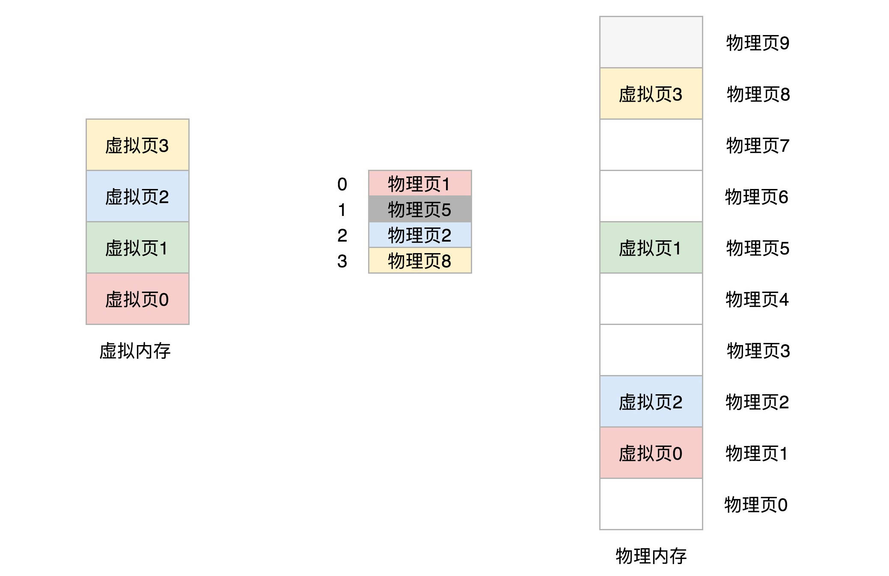

进程都认为自己独享内存空间。操作系统提供一种机制，将不同进程的虚拟地址和不同的内存物理地址映射起来。当程序要访问虚拟地址的时候，由内核的内存管理模块转换为物理地址。

真正能够访问物理内存的，只有内存管理系统，其他程序不论内核态还是用户态都不能直接访问物理内存，而是访问虚拟地址。


查看进程内存空间的布局： cat /proc/<pid>/maps

## 规划虚拟地址空间

- 物理内存的管理
- 虚拟内存地址的管理
- 虚拟地址与物理地址的映射

虚拟地址到物理地址的映射表，是内存管理模块的一部分，那么这个部分是“实”的还是“虚”的？

从虚拟地址角度，对于 64 位机器的进程来说（其实是 48 位），它认为自己有 256T 内存空间（32 位机器认为是 4G）。这么大空间一分为二，一部分内核空间一部分用户空间。内核空间在高地址位，用户进程是不能访问内核空间内存的。

- 我们从内存低地址开始看起，首先是代码段，数据段，BSS 段（未初始化的静态变量），这三部分都是从二进制文件中加载来的。
- 接下来是堆，堆是从低地址往高地址增长的。
- 接下来是 mmap。这块地址用于将文件映射到内存使用。比如 so 文件。
- 再往高位就是栈。
- 再往高就是内核空间。

代码段 - 数据段 - BSS 段 - 堆 - mmap - 栈 - 内核空间。

到了内核空间，无论哪个进程进来，看到的都是同一个进程列表，里面存着进程列表，内核线程等等。访问这些公共的数据结构，需要进行锁保护。

## 内存的分段机制

分段机制下虚拟地址由两个部分组成，段选择子和段内偏移量。

- 分段机制下虚拟地址由两部分组成，段选择子和段内偏移量。
- 段选择子就是保存在段寄存器里面的，里面最重要的是段号，用作段表的索引。
- 段表里面保存的是这个段的基地址、段的界限和特权等级。
- 虚地址中的段内偏移量应该位于 0 和段界限之间。
- 段基地址 + 段内偏移 -> 物理内存地址。

在 linux 中，段表称为段描述符表（segment descriptors），放在全局描述符表 GDT (global descriptor table)里面。一个段表项由段基地址、段界限，还有一些标识符组成。另外还会定义四个段选择子，指向上面的段描述符表项。

例如，我们将虚拟空间分为 4 段，分别标记为 0，1，2，3，每个段在段表中有一个项。如果要访问段 2 中偏移量 600 的虚拟地址，我们可以计算出其物理地址为 2600。


## 内存的分页机制

linux 采用分页机制来实现从虚拟地址到物理地址的转换。操作系统将物理地址分成一块块大小相同的页来管理。

- 换入和换出都是以页为单位的。
- 页大小一般为 4KB。
- 为定位每个页，需有个页表，保存页的起始地址，加上页内的偏移量，组成线性地址。



虚拟地址分为两部分：页号和页内偏移。虚拟内存中的页通过页表映射为物理内存中的页。



32 位环境下，虚拟地址空间为 4G，4k 一个页，就有 1M 页。每个页表项需要 4 个字节存储，就需要 4MB 内存存储映射表，如果每个进程都有自己的映射表，显然不可能。

页表中的页表项必须提前建好，并且连续。如果不连续就没办法通过虚拟地址里面的页号找到对应页表项了。

我们可以将页表再分页，4G 空间需要 4M 页表来存映射。我们把 4M 分成 1K 个 4K，每个 4K 又能放在一页里面，也就是 1K 个页。这 1K 个页也需要一个表管理，我们称为页目录表，这个页目录表里面有 1K 项，每项 4 字节，刚好 4K。

页目录有 1K 项，用 10 位就可以表示访问页目录哪一项。再用 10 位就可以表示访问页表项的哪一项。页表项中的一项就是一个页了，这个页的大小是 4K，再用 12 位可以定位这个页的任何一个位置。

这样的话，映射 4G 地址空间需要 4M+4K 内存，不是更大了么？但是，我们往往不会为一个进程分配那么多内存。所以在页表项那一级往往可以省下很多内存。


另外，对于 64 位系统，两级就不够用了，要变成 4 级目录。


## mmap 的原理

两个在堆里面分配内存的系统调用，brk 和 mmap。

当分配的内存数量比较小的时候，使用 brk，会和原来的堆的数据连在一起，这就像多分配两三个工位，在原来的区域旁边搬两把椅子就行了。当分配的内存数量比较大的时候，使用 mmap，会重新划分一块区域，也就是说，当办公空间需要太多的时候，索性来个一整块。

如果我们要在堆上申请小块内存，就用 brk。如果申请一块大内存，就用 mmap。对于堆的申请来说，mmap 是映射内存空间到物理空间。此外，如果一个进程想要映射一个文件到自己的虚拟内存，也要通过 mmap。这时 mmap 是映射内存空间到物理内存再到文件。

```c
// 查看 include/linux/mm_types.h
// 每个进程都有一个列表vm_area_struct，指向虚拟地址空间的不同内存块。
// 内存映射不仅是物理内存到虚拟内存，还包括将文件中的内容映射到虚拟内存空间。
// 这时候访问内存空间就能够访问到文件里面的数据（当然，也是通过了物理内存的）。
struct mm_struct {
  struct vm_area_struct *mmap;    /* list of VMAs */
}

struct vm_area_struct {

	unsigned long vm_start;
	unsigned long vm_end;

	/* linked list of VM areas per task, sorted by address */
	struct vm_area_struct *vm_next, *vm_prev;

	struct rb_node vm_rb;

	/*
	 * Largest free memory gap in bytes to the left of this VMA.
	 * Either between this VMA and vma->vm_prev, or between one of the
	 * VMAs below us in the VMA rbtree and its ->vm_prev. This helps
	 * get_unmapped_area find a free area of the right size.
	 */
	unsigned long rb_subtree_gap;

	struct mm_struct *vm_mm;	/* The address space we belong to. */
	pgprot_t vm_page_prot;		/* Access permissions of this VMA. */
	unsigned long vm_flags;		/* Flags, see mm.h. */

	struct {
		struct rb_node rb;
		unsigned long rb_subtree_last;
	} shared;

	struct list_head anon_vma_chain;
	struct anon_vma *anon_vma;

	/* Function pointers to deal with this struct. */
	const struct vm_operations_struct *vm_ops;

	/* Information about our backing store: */
	unsigned long vm_pgoff;
	struct file * vm_file;		/* File we map to (can be NULL). */
	void * vm_private_data;		/* was vm_pte (shared mem) */
}
```

```c
// arch/arm64/kernel/sys.c
SYSCALL_DEFINE6(mmap, unsigned long, addr, unsigned long, len,
		unsigned long, prot, unsigned long, flags,
		unsigned long, fd, unsigned long, off)
{
	if (offset_in_page(off) != 0)
		return -EINVAL;

	return ksys_mmap_pgoff(addr, len, prot, flags, fd, off >> PAGE_SHIFT);
}

// mm/mmap.c
SYSCALL_DEFINE6(mmap_pgoff, unsigned long, addr, unsigned long, len,
		unsigned long, prot, unsigned long, flags,
		unsigned long, fd, unsigned long, pgoff)
{
	return ksys_mmap_pgoff(addr, len, prot, flags, fd, pgoff);
}
```

如果要映射到文件，则会传一个文件描述符进来，mmap_pgoff 里面通过 fget 函数获取并打开文件。接下来的调用链是 vm_mmap_pgoff -> mmap_pgoff -> do_mmap。

然后调用 get_unmapped_area 找到一个没有映射的区域，并调用 mmap_region 映射这个区域。

## 用户态缺页异常

一旦开始访问虚拟内存的某个地址，但没有对应的物理页，就触发缺页异常，调用 do_page_fault。在\_\_do_page_fault 里先判断中断是否发生在内核。如果发生在内核则调用 vmalloc_fault。如果是在用户空间里面，就找到你访问的那个地址所在的区域 vm_area_struct，然后调用 handle_mm_fault 来映射这个区域。

进程要去使用内存的时候，才会使用系统调用来登记，说自己马上就要用了，希望分配一部分内存给它，但是这还不代表真的就对应到了物理内存。只有真的写入数据的时候，发现没有对应物理内存，才会触发一个中断，现分配物理内存。

## NUMA

处理器的 NUMA(Non-Uniform Memory Access，非一致性内存访问)架构，多个处理器被划分到不同 Node 上，且每个 Node 都拥有自己的本地空间。而同一个 Node 内部的内存空间，实际上又可以进一步分为不同的 zone，比如直接内存访问区(DMA)、普通内存区(NORMAL)、伪内存区(MOVABLE)等。

```sh
apt install numactl
numactl --hardware
```

## Swap

Swap 就是把一块磁盘空间或者一个本地文件当成内存来用，包含换入和换出两个过程。swap 把系统的可用内存变大了。常见的笔记本电脑休眠和快速开机的功能，就是基于 swap 的。

Linux 在内存不足以分配新的大块内存的时候，会发生 swap，以回收部分内存。此外，linux 还有一个专门的内核线程 kswapd0 来定期回收内存。

开启 Swap 后，你可以设置 /proc/sys/vm/min_free_kbytes ，来调整系统定期回收内存的阈值，也可以设置 /proc/sys/vm/swappiness ，来调整文件页和匿名页的回收倾向。

https://time.geekbang.org/column/article/75973

通常来说，降低 swap 的使用可以提高系统的整体性能。现在服务器内存都足够大，除非有必要，一般都应该禁用 swap。如果实在需要用到 swap，可以尝试降低 swappiness 的值，减少内存回收时 swap 的使用倾向。

响应延迟敏感的应用，如果它们可能在开启 swap 的服务器中运行，则可以用 mlock 或者 mlockall()锁定内存，阻止内存换出。

```sh
查看系统swappiness
sysctl vm.swappiness
或者
cat /proc/sys/vm/swappiness

临时禁用swap
sysctl -w vm.swappiness=0

永久禁用swap
echo "vm.swappiness = 0">> /etc/sysctl.conf
sysctl -p
```

# 内存

- free, top 查看内存使用总体情况
- vmstat 观察内存动态变化，观看 cache/buffer 的使用，swap 的大小等等。
- 如果 cache/buffer 有异常，则使用 cachetop 观察各个进程的缓存读写命中。
- sar 查看内存总体变化情况 sar -r 1

```sh
free -h
```

- used 已经使用的内存，包含共享内存
- free 未使用内存
- shared 共享内存
- buff/cache 缓存和缓冲区大小
- available 新进程可用内存大小（包含 free 和可回收的缓存）

buffers 是内核缓冲区用到的内存，对应 /proc/meminfo 中的 buffers 的值。buffers 是对原始磁盘块的临时存储，也就是用来缓存磁盘的数据，通常不会特别大（20MB 左右）。这样，内核就可以把分散的写集中起来，统一优化磁盘的写入，比如可以把多次小的写合并成单次大的写等等。
cache 是内核页缓存和 slab 用的内存，对应 /proc/meminfo 中的 cached 与 SReclaimable 之和。Cached 是从磁盘读取文件的页缓存，也就是用来缓存从文件读取的数据。这样，下次访问这些文件数据时，就可以直接从内存中快速获取，而不需要再次访问缓慢的磁盘。SReclaimable 是 Slab 的一部分。Slab 包括两部分，其中的可回收部分，用 SReclaimable 记录；而不可回收部分，用 SUnreclaim 记录。

事实上，这里的 Buffer 是将要写入磁盘的数据的缓存，也可以用作读取磁盘数据的缓存。而 cache 是从文件读取数据的缓存，也可用作写文件的页缓存。

```sh
# cachestat 和 cachetop 都来自bcc-tools，基于内核的eBPF(extended Berkeley Packet Filters)
cachestat 1 3
# HITS，     表示缓存命中次数；
# MISSES，   表示缓存未命中的次数。
# DIRTIES    表示新增到缓存总的脏页数
# BUFFERS_MB 表示BUFFERS大小
# CACHED_MB  表示CACHE大小

## 默认按照缓存的命中次数（HITS）排序，展示了每个进程的缓存命中情况。具体到每一个指标，这里的 HITS、MISSES 和 DIRTIES
cachetop
```

磁盘是块设备文件，如果直接写磁盘则会跳过文件系统，而如果写文件则会利用文件系统，由文件系统来写磁盘。事实上这两种不同的读写方式使用的缓存就是分别为 buffer 和 cache。

```sh
top
```

- VIRT 进程虚拟内存大小，只要是进程申请过的内存，即使还没有真正分配物理内存，也会计算在内。
- RES 常驻内存大小，也就是实际使用的内存。（不包括 swap 和共享内存）。
- SHR 共享内存，比如与其他进程共同使用的内存，加载的动态链接库以及程序代码段等等。
- %MEM 进程使用的物理内存占系统总内存的百分比。

```sh
# 清理文件页，目录项，Inodes等各种缓存
echo 3 > /proc/sys/vm/drop_caches

# vmstat 查看内存使用
vmstat 1

# 读文件
dd if=/tmp/file of=/dev/null
# 直接读磁盘
dd if=/dev/sda1 of=/dev/null bs=1M count=1024
# 写文件
dd if=/dev/urandom of=/tmp/file bs=1M count=500
# 直接写磁盘
dd if=/dev/urandom of=/dev/sdb1 bs=1M count=2048
```

```sh
查看系统swappiness
sysctl vm.swappiness
或者
cat /proc/sys/vm/swappiness

临时禁用swap
sysctl -w vm.swappiness=0

永久禁用swap
echo "vm.swappiness = 0">> /etc/sysctl.conf
sysctl -p
```
