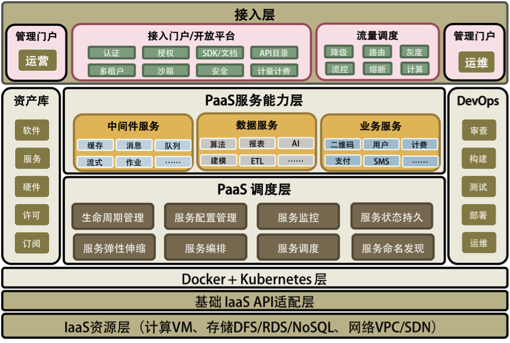
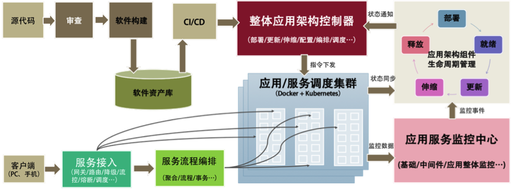

## 软件工程能力

- 提高服务的 SLA，高可用的系统，自动化的运维。
- 能力和资源重用或复用。软件模块重用，软件标准化的能力，统一开放和运维的管理方式。
- 过程的自动化。将软件生产和运维过程自动化起来，使用 CI/CD。

## pass 平台

- 服务化是 pass 的本质。软件模块重用，服务治理，对外提供能力是 pass 的本质。
- 分布式是 pass 的根本特性。多租户隔离，高可用，服务编排是 pass 的根本。
- 自动化是 pass 的灵魂。自动化部署安装运维，自动化伸缩调度是 pass 的关键。

一个好的 pass 平台应该是分布式，服务化，自动化部署，高可用，敏捷，分层开放的。

## pass 平台总体架构

在 k8s 之上有两个相关的 PaaS 层。一个是 PaaS 调度层(iPaaS)；另一个是 PaaS 能力层(aPaaS)。没有 PaaS 调度层，PaaS 能力层很难被管理和运维，而没有 PaaS 能力层，PaaS 就失去了提供实际能力的业务价值。

在两个 PaaS 层之上，有一个流量调度的接入模块，这也是 PaaS 中非常关键的东西。流控、路由、降级、灰度、聚合、串联等等都在这里，包括最新的 AWS Lambda Service 的小函数等也可以放在这里。这个模块应该是像 CDN 那样来部署的。

然后，在这个图的两边分别是与运营和运维相关的。运营这边主要是管理一些软件资源方面的东西（类似 Docker Hub 和 CMDB），以及外部接入和开放平台上的东西，这主要是对外提供能力的相关组件；而运维这边主要是对内的相关东西，主要就是 DevOps。

总结一下，一个完整的 PaaS 平台会包括以下几部分。

- PaaS 调度层:主要是 PaaS 的自动化和分布式对于高可用高性能的管理。
- PaaS 能力服务层:主要是 PaaS 真正提供给用户的服务和能力。
- PaaS 的流量调度:主要是与流量调度相关的东西，包括对高并发的管理。
- PaaS 的运营管理:软件资源库、软件接入、认证和开放平台门户。
- PaaS 的运维管理:主要是 DevOps 相关的东西。

## pass 平台生产和运维

