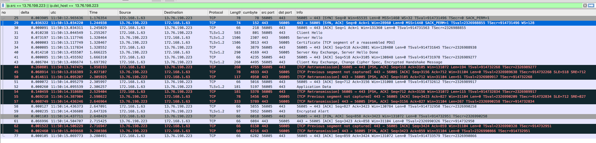

## TLS 与 SSL(属于 TCP/IP 模型的应用层)

- 1995 年，SSL3.0;
- 1999 年，TLS1.0;
- 2006 年，TLS1.1;
- 2008 年，TLS1.2;
- 2018 年，TLS1.3;

## TLS 安全加密套件

TLS_ECDHE_RSA_WITH_AES_128_GCM_SHA256, 其中 ECDHE 表示秘钥交换，RSA 表示身份验证，AES 是算法，128 是分组长度（越大加密强度越强），GCM 是加密模式，SHA256 是 MAC 或 PRF。

#### AES 对称加密

AES 对称加密是一种**基于异或运算实现的分组加密算法**，其可以使用多种工作模式。

分组工作模式（block cipher mode of operation）就是允许使用同一个分组秘钥对多块数据进行加密。最简单的分组工作模式是 ECB(electronic codebook)模式，这种模式直接将明文分解成多个块，然后对每个块进行加密。ECB 的缺点很明显，由于每块都使用同一个秘钥加密，所以会暴露数据特征。

CBC 模式（Cipher-block chaining）解决了 ECB 暴露数据特征的问题，它将每一个明文和前一个数据块异或后再加密，但是这样会导致加密和解密都是串行的，不能利用多核并行，也无法利用专用并行计算芯片加速。

CTR 模式（counter）则通过递增一个加密计数器以产生连续的密钥流，解决了暴露数据特征的问题，但还是存在一个问题，不能提供密文消息完整性校验。

GCM 模式则就是在 CTR 模式上加以改进，引入 GMAC 来校验信息完整性。

总结一下，上面的 AES_128_GCM 就表示使用分组长度 128 位（16 字节）的 AES 对称加密算法，使用 GCM 工作模式，GCM 模式利用计数器生成连续密钥流来防止数据特征暴露，并通过 GMAC 校验信息完整性。

可以用 AES 加密和解密个文件玩儿。

```
openssl enc -aes-256-cbc -in inputfile.txt -out encrypted.bin
openssl enc -aes-256-cbc -d -in encrypted.bin
```

SSL，非对称加密，CA 证书。

https 在证书校验阶段使用非对称加密，而在内容传输时使用对称加密。

## tls 秘钥交换过程



- Client hello, 客户端会提供很多安全套件，并且会生成一个随机数 R1 一起发给给服务端。
- Server hello, 服务端会选择一个安全协议。比如 TLS_ECDHE_RSA_WITH_AES_256_GCM_SHA384。同时还是会生成一个随机数 R2 一起发给客户端。
- Server 再发回一个 certificate 包，将自己的证书发给客户端。（证书通常都配在了 nginx 等网关的配置里面了）
- 客户端收到证书后，验证证书是否可信，并 ACK。
- 服务端发起秘钥交换,将自己的公钥发给客户端，并告知椭圆曲线, Server key Exchange, Server Hello Done,。
- Client key Exchange, Change Cipher Spec,客户端也发回自己的公钥，同时发回一个随机数 R3。
- 双方各自基于两把钥匙生成相同的密钥，也就是后面通信用的对称加密的密钥。

## 证书验证
