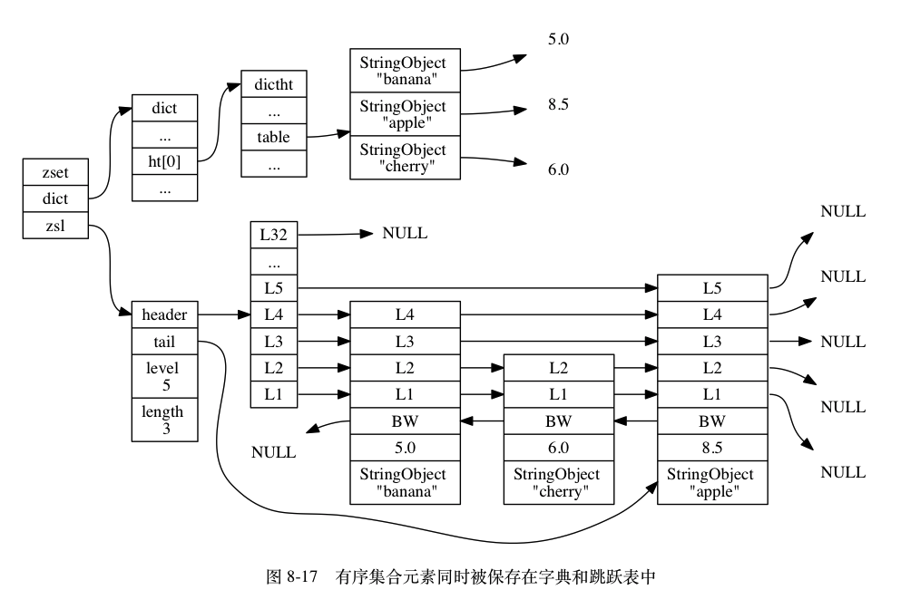

## 数据结构

键：string , 值：string, set, hash, list, zset
Simple Dynamic String 除了被用来保存字符串值，还被用作缓冲区：AOF 模块的 AOF 缓冲区，以及客户端的输入缓冲区。

```c
struct sdshdr {
    int len;
    int free;
    char buf[];
}
```

sds 避免了 c 字符串的缓冲区溢出问题，并且对字符串修改更友好。

## 链表

List 底层就是个双向链表。链表键的底层实现之一就是链表。

pubsub, 慢查询日志，监视器等也用到了链表。redis 服务器本身还使用链表保存客户端状态信息。

```c
typedef struct listNode {
    struct listNode *prev;
    struct listNode *next;
    void *value;
} listNode;

typedef struct list {
    listNode *head;
    listNode *tail;
    // 链表内节点数量
    unsigned long len;
    // 节点值复制函数
    void *(*dup)(void *ptr);
    // 节点值释放函数
    void (*free)(void *ptr);
    // 节点值对比函数
    int (*match)(void *ptr, void *key);
}
```

## hash

Redis 数据库就是用 hash 作为底层实现的。

```c
typedef struct dictht {
    dictEntry **table;    // 哈希表数组
    unsigned long size;    // 哈希表大小
    unsigned long sizemask; // 哈希表大小掩码
    unsigned long used;    // 哈希表已有节点数量
} dictht;

typedef struct dictEntry {
    void *key  // 键
    union (
        void *val;
        uint64_tu64;
        int64_ts64;
    ) v;
    struct dictEntry *next;
} dictEntry;
```

字典

```c
typedef struct dict {
    dictType *type;  // 类型
    void *privdata;  // 私有数据
    dictht ht(2);    // 哈希表
    int trehashidx;  // 当rehash 不在进行时，值为-1
}
// 一般情况下字典只使用ht[0]，只会在rehash的时候使用ht[1]。

typedef struct dictType {
    // 计算哈希值的函数
    unsigned int (*hashFunction) (const void *key);
    // 复制键的函数
    void *(*keyDup) (void *privdata, const void *key);
    // 复制值的函数
    void *(*valDup) (void *privdata, const void *obj);
    // 对比键的函数
    void *(*keyCompare) (void *privdata, const void *key1, const void *key2);
    // 销毁键的函数
    void *(*keyDestructor) (void *privdata, const void *key);
    // 销毁值的函数
    void *(*valDestructor) (void *privdata, const void *obj);
}
```

#### rehash 与渐进式 rehash

## 跳表

大部分情况下，跳表可以和平衡树媲美。


## 整数集合(intset)

```c
typedef struct intset {
    // 编码方式
    uint32_t encoding;
    // 集合包含的元素数量
    uint32_t length;
    // 保存元素的数组
    int8_t contents[];
} intset;
```

整数集合的每个元素都是 contents 数组的一个数组项（item）， 各个项在数组中按值**从小到大有序地排列**， 并且数组中不包含任何重复项。
length 属性记录了整数集合包含的元素数量， 也即是 contents 数组的长度。

[intset](http://redisbook.com/preview/intset/datastruct.html)

整数集合的升级与降级。

intset 是为了提供一种对整数类型更省内存的 set 的实现，当 set 元素较少且都是整数的时候会使用 intset，不然使用 dict。

## 压缩列表（ziplist）

- 压缩列表（ziplist）是列表键和哈希键的底层实现之一。
- 当一个列表只包含少量列表项，并且每个列表项要么就是小整数值，要么就是长度比较短的字符串，Redis 就会使用压缩列表来做列表键的底层实现。
- ziplist 是一个经过特殊编码的双向链表，设计目标是为了提高存储效率。
- ziplist 可以用于存储字符串或整数，其中整数是按照真正的二进制编码的，而不是存储字符串。
- ziplist 充分体现了 redis 对于存储效率的追求，对于一个普通的双向链表，链表中每项都占用独立的一块内存，各项用指针连接起来。这种方式会带来大量内存碎片，指针也会占用额外内存。
- 而 ziplist 将每一项放在前后连续的地址空间，一个 ziplist 占一大块内存。所以 ziplist 其实不是所谓的 linked list。
- ziplist 还对值存储采用了变长的编码方式。
- ziplist 采用小端模式(little endian)来存储。小端就是低位在低地址，高位在高地址。处理器大多都是小端，而网络字节序是大端序。
- 如何判断一个机器是大端还是小端？写个 int 1，然后转型成 char，看是否还是 1，如果是，则是小端。

```
数据结构
<zlbytes><zltail><zllen><entry>…<entry><zlend>
<zlbytes>：表示ziplist占用的字节总数。
<zltail>：表示ziplist中最后一项在ziplist中的偏移字节数（这能方便我们快速找到最后一项）。
<zllen>：表示ziplist中数据项(entry)个数。
<entry>：真正的数据项，长度不定，entry内部也有自己的结构。
<zlend>：ziplist最后一个字节，是一个结束标记，固定为255。

```

## quicklist

quicklist 是一个 ziplist 的双向列表。

quicklist 节点包含多长的 ziplist 合适呢？ziplist 越短，则内存碎片越多。ziplist 越长，为 ziplist 分配连续内存空间的难度越大。redis 提供了一个配置参数 list-max-ziplist-size
当取正值的时候，表示按照数据项个数来限定每个 quicklist 节点上的 ziplist 长度。比如，当这个参数配置成 5 的时候，表示每个 quicklist 节点的 ziplist 最多包含 5 个数据项。

## 对象

redis 并没有直接使用这些数据结构来实现键值对数据库，而是基于这些数据结构创建一个对象系统，这个系统包含字符串，列表，哈希，集合，有序集合五种。

redis 的对象系统实现了基于 reference counting 的 gc 机制。

redis 还通过 reference counting 实现了对象共享机制，可以让多个数据库键共享同一个对象来节约内存。
目前来说，redis 会在初始化的时候创建一万个字符串对象，包含了从 0 到 9999 的所有整数值，当服务器需要用 0 到 9999 时，直接用这些共享对象，而不是创建新对象。

```c
typedef struct redisObject {
    unsigned type:4;      // 类型
    unsigned encoding:4;  // 编码
    void *ptr;            // 指向底层实现数据结构的指针
    int refcount;         // 引用计数
    unsigned lru:22;      // 记录对象最后一次被命令访问的时间
} robj;
```

type 命令可以用于查看键值对象的类型。

OBJECT ENCODING 命令可以用于产科键值对象的编码。

OBJECT IDLETIME 命令可以打印键的空转时长。

## 为什么 zset 要使用 skiplist 和哈希表实现

- 链表中数据如何进行二分查找呢？可以把链表改造成跳表，就能实现类似于二分查找的算法。
- 对于链表，即使是有序的，要完成查找也要遍历整个 List，怎么提高查找效率呢？可以对链表建立一级索引。
- 红黑树也可以实现快速插入、删除和查找，相比之下 skiplist 有啥优势呢？ 按区间查找数据更方便。
- 跳表查询有多快？ O(log n)， 空间换时间。
- 单链表的插入慢在找到插入位置。而对跳表来说查找插入位置的时间复杂度就是 O(log n)。
- 跳表删除节点还要更麻烦一点，因为不但要删原始链表中的，还要删索引链表中的。
- 当我们往跳表中插入数据时，可以选择同时将这个数据插入到部分索引层中。如何选择呢？
- 随机函数决定。比如随机函数生成了值 K，那么我们就插入第 1 级到第 K 级的索引中。
- https://github.com/wangzheng0822/algo/blob/master/java/17_skiplist/SkipList.java
- Redis 的有序集合（zset）同时使用了跳表和 hashmap。
- 跳表能够很好地完成 zrank, zrange 等和顺序啊范围啊有关的操作
- 而 Hashmap 用于搞定查某个成员分值之类的需求。
- 优化：当有序集合保存的元素数量小于 128 个，有序集合保存的所有元素成员长度都小于 64 字节的时候使用 ziplist，否则都使用跳表。



## expire 是怎么实现的？
