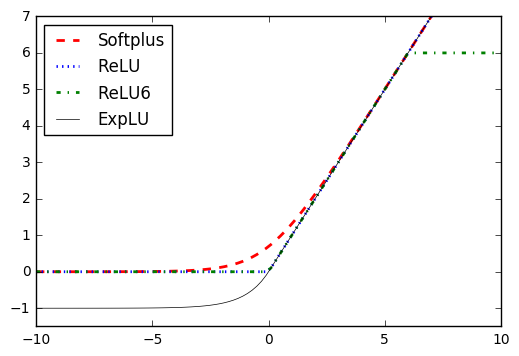
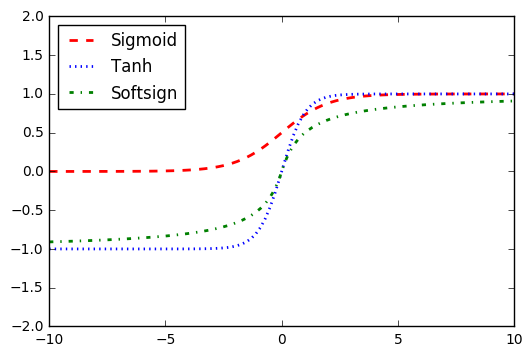
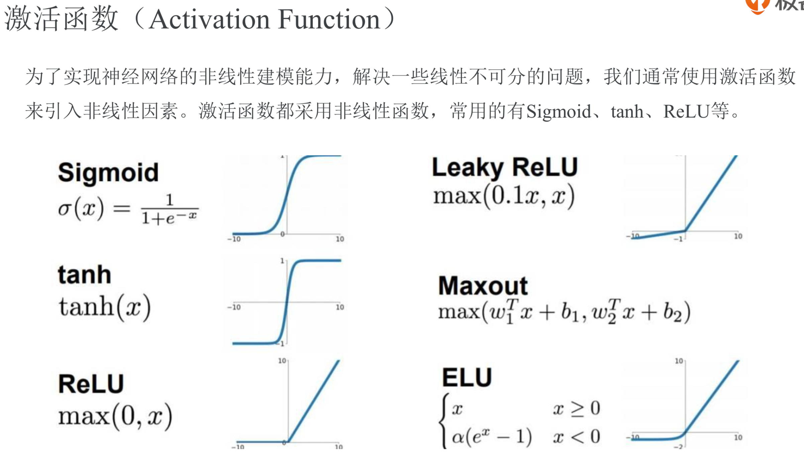

```py
x_vals = np.linspace(start=-10., stop=10., num=100)
tf.nn.relu(x_vals)
tf.nn.relu6(x_vals)
tf.nn.sigmoid(x_vals)
tf.nn.tanh(x_vals)
tf.nn.softsign(x_vals)
tf.nn.softplus(x_vals)
tf.nn.elu(x_vals)

plt.plot(x_vals, y_softplus, 'r--', label='Softplus', linewidth=2)
plt.plot(x_vals, y_relu, 'b:', label='ReLU', linewidth=2)
plt.plot(x_vals, y_relu6, 'g-.', label='ReLU6', linewidth=2)
plt.plot(x_vals, y_elu, 'k-', label='ExpLU', linewidth=0.5)
plt.ylim([-1.5,7])
plt.legend(loc='upper left')
plt.show()

plt.plot(x_vals, y_sigmoid, 'r--', label='Sigmoid', linewidth=2)
plt.plot(x_vals, y_tanh, 'b:', label='Tanh', linewidth=2)
plt.plot(x_vals, y_softsign, 'g-.', label='Softsign', linewidth=2)
plt.ylim([-2,2])
plt.legend(loc='upper left')
plt.show()
```






