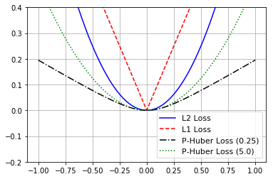
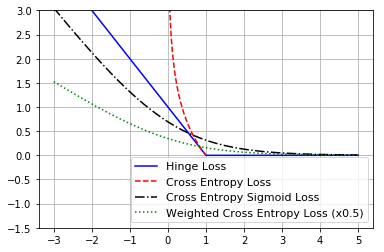

loss function 在不同位置的梯度需要重点关注

## Numerical Predictions

```py
x_vals = tf.linspace(-1., 1., 500)
target = tf.constant(0.)

l2_y_out = sess.run(tf.square(target - x_vals))
l1_y_out = sess.run(tf.abs(target - x_vals))

# pseudo-huber loss
#L = delta^2 * (sqrt(1 + ((pred - actual)/delta)^2) - 1)
delta1 = tf.constant(0.25)
ph1_y_out = tf.multiply(tf.square(delta1), tf.sqrt(1. + tf.square((target - x_vals) / delta1)) - 1.)
```



## categorical predictions

```py
x_vals = tf.linspace(-3. 5., 500)
target = tf.constant(1.)
targets = tf.fill([500,], 1.)

# hinge loss  
# L = max(0, 1 - pred * actual)
hinge_y_out = sess.run(tf.maximum(0., 1. - tf.multiply(target, x_vals)))

# cross entropy loss 
# L = -actual*(log(pred)) - (1-actual)(log(1-pred))
xentropy_y_out = sess.run(- tf.multiply(target, tf.log(x_vals)) - tf.multiply((1. - target), tf.log(1. - x_vals)))

# weighted (softmax) cross entropy loss
# L = -actual * (log(pred)) * weights - (1-actual)(log(1-pred))
# or
# L = (1 - pred) * actual + (1 + (weights - 1) * pred) * log(1 + exp(-actual))
weight = tf.constant(0.5)
xentropy_weighted_y_out = sess.run(tf.nn.weighted_cross_entropy_with_logits(logits=x_vals,
                                                                            targets=targets,
                                                                            pos_weight=weight))
```

