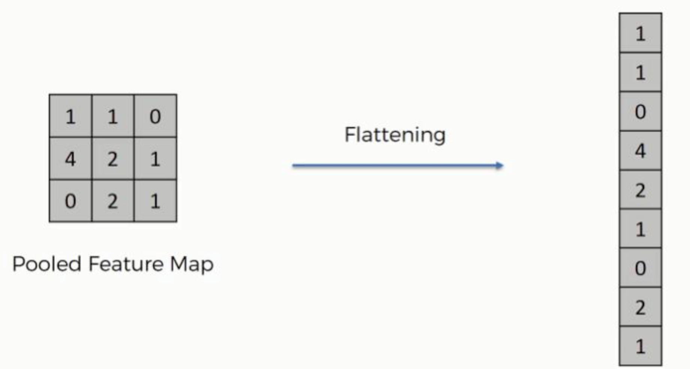

## 卷积

卷积的优良特性：稀疏感知性，参数共享性和平移不变性。

稀疏感知性：卷积层核函数远小于图像，小的核函数有助于发现图像中的细微局部特征，提升算法效率。

参数共享性：在同一个模型中使用相同参数，说白了就是用一个相同的核函数和所有的图像块进行卷积，这显著降低了核函数数目。**参数共享的基础是对图像特征的提取与图像的位置无关。如果在图像上某个区域这些像素构成直线，那么在其他区域它们仍然是直线。**这说明图像的统计特性并不取决于空间位置。

平移不变性：当卷积的输入产生平移时，其输出等于原始输出做出相同数量的平移。平移操作和核函数的作用是可以交换的。

为什么卷积运算可以实现特征提取呢？事实上，卷积操作不过就是计算两个矩阵的近似程度，卷积输出越大表明卷积核与图像区域越相似。因此，通过设置**合理的核函数**,卷积层就能提取出图像的特征。如果核函数表示一个直角，则原始图像中的直角就体现为 feature map 中较大的数。

```py
tf.nn.conv2d(
    input,  # a 4-D Tensor of shape [batch, height, width, channels]
    filter=None,  # Must have the same type as input, 4-D tensor of shape [filter_height, filter_width, in_channels, out_channels]
    strides=None,  # int or list of ints that has length 1, 2 or 4.
    padding=None,
    use_cudnn_on_gpu=True,
    data_format="NHWC",
    dilations=[1,1,1,1],
    name=None,
    filters=None  # Alias for filter
)
```

## 池化

CNN 的卷积层之间通常会周期性地插入池化层（更恰当的名字是下采样层 downsampling layer）,用于对卷积层输出的 feature map 进行筛选。map pooling 的做法就是将 feature map 分成若干矩形，挑选矩形中的最大值。这样的做法大大减少了要训练的权重量，也能减小过拟合的风险。

此外，池化还给图像带来了旋转不变性，因为图像无论如何旋转，每个区域的最大值都不会改变。

池化机制的应用也可以看成是参数共享：在一个图像区域有用的特征极有可能在另一个区域同样适用。对不同位置的特征进行聚合统计就是提取图像主要特征的有效方法。

池化能发挥作用的原因在于**特征在图像中的绝对位置远不及它和其他特征的相对位置的关系来得重要**

```py
tf.nn.max_pool(
    value,     # a 4-D Tensor of shape [batch, height, width, channels]
    ksize,     # int or list of ints that has length 1, 2 or 4. The size of the window
    strides,   # int or list of ints that has length 1, 2 or 4. The stride of the window
    padding,   # "SAME" or "VALID"
    data_format='NHWC',    # "NHWC" or "NCHW"
    name=None,
    input=None,     # Alias for value
)
```

除了 max pooling 外，常见的池化层还有 avg pooling，目前主流的池化还是选择 max pooling。不过 ResNet 和 Inception 最后一层都采用了平均池化。

有时候在模型末端还会使用全局池化代替 Flatten 操作，使输入数据变成一维向量。

## dropout

for each element of x, with probability rate, output 0, and otherwise scales up the input by 1 / (1 - rate). The scaling is such that the expected sum is unchanged.

dropout 是一种针对训练数据的正则化，因为它构造了不同的数据集来训练不同的模型，每个数据集通过对原始数据集进行**有放回采样**得到。可以认为 dropout 是一种集成方法，通过结合多个模型来减轻过拟合（降低泛化误差）。

dropout 的想法是在训练中随机丢弃神经元与连接，得到简化的网络，而且感觉上每次都在训练不同的网络。整个 dropout 过程相当于对很多个神经网络取平均，而不同的网络产生不同的拟合。

但是 dropout 只有在训练集较大时才有效果。

```py
tf.nn.dropout(
    x,
    keep_prob=None,
    noise_shape=None,
    seed=None,
    name=None,
    rate=None
)
```

## flatten

用于将卷积核池化后提取的特征摊平后输入全连接网络



## fully_connected

## Conv2DTranspose

Transposed convolution layer (sometimes called [Deconvolution](https://www.matthewzeiler.com/mattzeiler/deconvolutionalnetworks.pdf))


```py
tf.keras.layers.Conv2DTranspose

```
