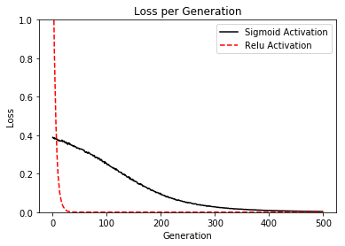

In this chapter, we'll cover the following recipes:

- Implementing Operational Gates
- Working with Gates and Activation Functions
- Implementing a One Layer Neural Network
- Implementing Different Layers
- Using Multilayer Networks
- Improving Predictions of Linear Models
- Learning to Play Tic Tac Toe

The concept of a neural network has been around for decades. However, it only recently gained traction because we now have the computational power to train large networks because of advances in processing power, algorithm efficiency, and data sizes.

A neural network is basically a sequence of operations applied to a matrix of input data. 

**The important trick with neural networks is called 'back propagation'.** Back propagation is a procedure that allows us to update the model variables based on the learning rate and the output of the loss function. 

**Another important feature to take note of in neural networks is the non-linear activation function.** Since most neural networks are just combinations of addition and multiplication operations, they will not be able to model non-linear data sets. To address this issue, we have used the non-linear activation functions in the neural networks. This will allow the neural network to adapt to most non-linear situations.

There are more resources for learning about neural networks that are more in depth and detailed. Here are some following resources:

- The seminal paper describing back propagation is Efficient Back Prop by Yann LeCun et. al. The PDF is located here: http://yann.lecun.com/exdb/publis/pdf/lecun-98b.pdf

- CS231, Convolutional Neural Networks for Visual Recognition, by Stanford University, class resources available here: http://cs231n.stanford.edu/

- CS224d, Deep Learning for Natural Language Processing, by Stanford University, class resources available here: http://cs224d.stanford.edu/

- Deep Learning, a book by the MIT Press. Goodfellow, et. al. 2016. Located: http://www.deeplearningbook.org

- There is an online book called Neural Networks and Deep Learning by Michael Nielsen, located here: http://neuralnetworksanddeeplearning.com/

- For a more pragmatic approach and introduction to neural networks, Andrej Karpathy has written a great summary and JavaScript examples called A Hacker's Guide to Neural Networks. The write up is located here: http://karpathy.github.io/neuralnets/

- Another site that summarizes some good notes on deep learning is called Deep Learning for Beginners by Ian Goodfellow, Yoshua Bengio, and Aaron Courville. This web page can be found here: http://randomekek.github.io/deep/deeplearning.html

### gates
One gate will be one operation with a variable and a placeholder. We will ask tensorflow to change the variable based on our loss function.

```py
a = tf.Variable(tf.constant(4.))
x_val = 5.
x_data = tf.placeholder(dtype=tf.float32)

multiplication = tf.multiply(a, x_data)

# loss, the difference between the output and a target value 50
tf.square(tf.subtract(multiplication, 50.))

# initialize variable
sess.run(tf.global_variables_initializer())

# optimizer
tf.train.GradientDescentOptimizer(0.01).minimize(loss)

# run the loop, optimizing a multiplication gate output to 50
print('Optimizing a Multiplication Gate Output to 50.')
for i in range(10):
    sess.run(train_step, feed_dict={x_data: x_val})
    a_val = sess.run(a)
    mult_output = sess.run(multiplication, feed_dict={x_data: x_val})
    print(str(a_val) + ' * ' + str(x_val) + ' = ' + str(mult_output))

# Optimizing a Multiplication Gate Output to 50.
# 7.0 * 5.0 = 35.0
# 8.5 * 5.0 = 42.5
# 9.25 * 5.0 = 46.25
# 9.625 * 5.0 = 48.125
# 9.8125 * 5.0 = 49.0625
# 9.90625 * 5.0 = 49.5312
# 9.95312 * 5.0 = 49.7656
# 9.97656 * 5.0 = 49.8828
# 9.98828 * 5.0 = 49.9414
# 9.99414 * 5.0 = 49.9707
```

### combining gates and activation functions

```py
batch_size = 50

a1 = tf.Variable(tf.random_normal(shape=[1,1]))
b1 = tf.Variable(tf.random_uniform(shape=[1,1]))
a2 = tf.Variable(tf.random_normal(shape=[1,1]))
b2 = tf.Variable(tf.random_uniform(shape=[1,1]))
x = np.random.normal(2, 0.1, 500)
x_data = tf.placeholder(shape=[None, 1], dtype=tf.float32)

sigmoid_activation = tf.sigmoid(tf.add(tf.matmul(x_data, a1), b1))

relu_activation = tf.nn.relu(tf.add(tf.matmul(x_data, a2), b2))

loss1 = tf.reduce_mean(tf.square(tf.subtract(sigmoid_activation, 0.75)))
loss2 = tf.reduce_mean(tf.square(tf.subtract(relu_activation, 0.75)))

sess.run(tf.global_variables_initializer())

train_step_sigmoid = tf.train.GradientDescentOptimizer(0.01).minimize(loss1)
train_step_relu = tf.train.GradientDescentOptimizer(0.01).minimize(loss2)

print('\nOptimizing Sigmoid AND Relu Output to 0.75')
loss_vec_sigmoid = []
loss_vec_relu = []
for i in range(500):
    rand_indices = np.random.choice(len(x), size=batch_size)
    x_vals = np.transpose([x[rand_indices]])
    sess.run(train_step_sigmoid, feed_dict={x_data: x_vals})
    sess.run(train_step_relu, feed_dict={x_data: x_vals})
    
    loss_vec_sigmoid.append(sess.run(loss1, feed_dict={x_data: x_vals}))
    loss_vec_relu.append(sess.run(loss2, feed_dict={x_data: x_vals}))    
    
    sigmoid_output = np.mean(sess.run(sigmoid_activation, feed_dict={x_data: x_vals}))
    relu_output = np.mean(sess.run(relu_activation, feed_dict={x_data: x_vals}))
    
    if i%50==0:
        print('sigmoid = ' + str(np.mean(sigmoid_output)) + ' relu = ' + str(np.mean(relu_output)))
```

